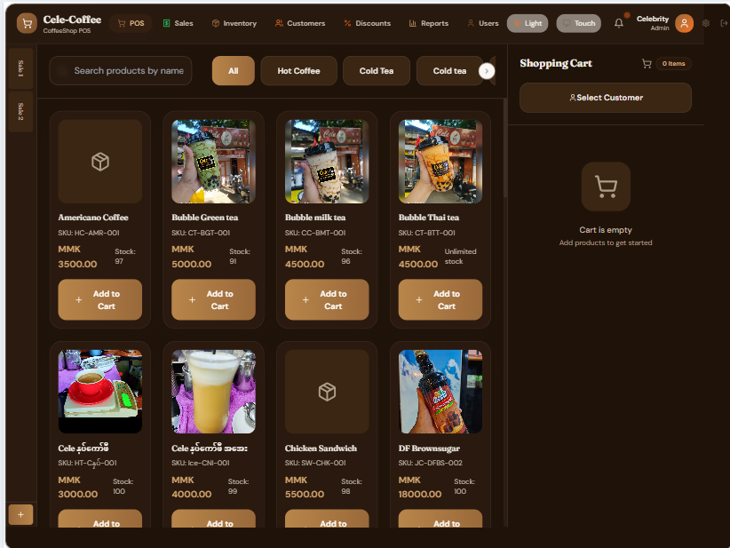
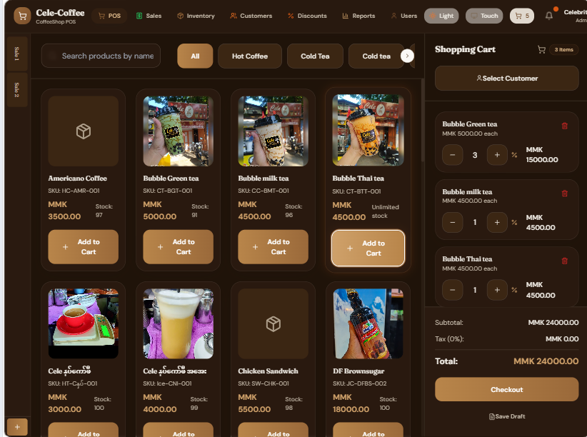
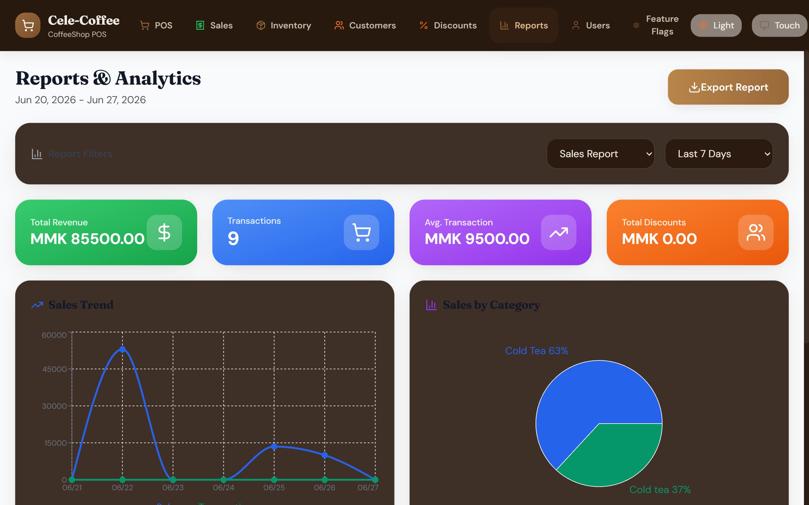

# CoffeeShop POS

A multi-tenant, web-based point-of-sale platform built for coffee shops, food courts, and small-to-medium restaurants — with a focus on the Myanmar market. Supports 9 payment methods including KBZpay, WavePay, AYAPay, CBPay, and MPU. Installable as a PWA on iPad and Android. Multi-tenancy foundation is in place with `shop_id` scoping and role-based access; dynamic per-shop configuration is specified and pending implementation.


**Live Demo:** [https://pos-system-gilt-mu.vercel.app](https://pos-system-gilt-mu.vercel.app)

---

## Screenshots

| POS Terminal | Checkout | Reports |
|:---:|:---:|:---:|
|  |  |  |

---

## Features

### POS Terminal
- Product grid with search, category filter, stock indicators
- Cart with quantity control, per-item discounts, customer assignment
- 9 payment methods: Cash, Card, KBZpay, WavePay, AYAPay, CBPay, MPU, Digital, Credit
- Split payments across multiple methods
- Card type auto-detection (Visa/Mastercard/Amex/Discover)
- Credit sales with customer credit limit tracking
- Draft sales — save incomplete transactions, resume later
- Multi-tab sales — serve multiple customers simultaneously
- Receipt printing with @media print styles
- Weight-based products (per-kg/lb/g pricing)

### Inventory Management
- Product CRUD with image upload, batch tracking, SKU/barcode
- Stock auto-deduction on sale completion
- Low-stock and out-of-stock indicators
- Inventory reports: value, turnover ratio, profit margin

### Customer Management
- Customer database with credit system (limit/used/available)
- Price tiers: Standard, Premium, VIP, Wholesale
- Transaction history per customer
- Credit payment validation at checkout

### Discount Engine
- 4 discount types: percentage, fixed, free_gift
- 6 condition types: min_amount, specific_products, payment_method, customer_tier, card_type, bank_name
- Valid days (Sun-Sat), date ranges, max discount caps
- Auto-apply at checkout — no barista intervention needed

### Reports & Analytics
- Sales trends (line chart), category distribution (pie chart)
- Top products, customer spending patterns
- Inventory analytics: stock status, value by category, turnover
- Date range filter: today, 7/30/90 days, custom range
- CSV export for all reports

### Multi-Currency
- 11 supported currencies: USD, EUR, GBP, CAD, LKR, JPY, AUD, CHF, CNY, INR, MMK
- Exchange rate management with API integration or manual override
- Currency conversion with 5-minute in-memory cache
- Base currency + display currency separation

### User Management & RBAC
- 3 roles: Admin (full access), Manager (POS+inventory+reports), Cashier (POS only)
- Role-based navigation — cashiers see POS only, managers see everything except user management
- RLS enforced at database level — not just UI

### PWA
- Installable on iPad ("Add to Home Screen") and Android
- Service worker precaches app shell
- Supabase API cached with NetworkFirst strategy (5s timeout)
- Cart persists across page refresh via localStorage

### Multi-Tenancy (Foundation)
- `shop_id` foundation on tenant-scoped tables with default shop UUID
- `shops` and `shop_memberships` tables for per-shop roles
- RLS policies scoped via `current_shop_ids()` helper function
- Schema foundation complete — UI for shop switching deferred

---

## Tech Stack

| Layer | Technology |
|-------|-----------|
| Frontend | React 18.3, TypeScript 5.5 (strict) |
| Styling | Tailwind CSS 3.4 — Espresso & Copper design system |
| State | React Context + useReducer (5 providers) |
| Backend | Supabase (PostgreSQL, Auth, REST API) |
| Build | Vite 5.4 with code-splitting |
| PWA | vite-plugin-pwa (Workbox) |
| Animations | Framer Motion |
| Charts | Recharts |
| Icons | Lucide React |
| Notifications | SweetAlert2 |
| Dates | date-fns |

---

## Quick Start

### Prerequisites

- Node.js ≥ 18.x
- npm ≥ 9.x
- Supabase project ([supabase.com](https://supabase.com))

### Setup

```bash
# 1. Clone
git clone git@github.com:kohtun386/POS-system.git
cd POS-system

# 2. Install
npm install

# 3. Environment
# Create .env file with your Supabase credentials:
VITE_SUPABASE_URL=https://<your-project-ref>.supabase.co
VITE_SUPABASE_ANON_KEY=<your-anon-key>

# 4. Database
supabase login
supabase link --project-ref <your-project-ref>
supabase db push

# 5. Run
npm run dev
# → http://localhost:5173
```

### Create Admin / Approve User

1. Supabase Dashboard → Authentication → Users → Invite user by email, or let the user sign up via the app
2. DB trigger `handle_new_auth_user()` creates a pending profile/shop/membership skeleton for self-registration
3. Instant access after signup is deprecated; access requires `users.active`, `shop_memberships.is_active`, and `shops.is_active`
4. In Supabase SQL Editor, assign role and activate the user/shop records:

```sql
UPDATE users SET role = 'admin', active = true WHERE email = 'your@email.com';\n-- Also activate the related shop_memberships row and shop row for self-registration.
```

### Scripts

| Command | Purpose |
|---------|---------|
| `npm run dev` | Dev server with HMR. `--host` exposes on local network for iPad testing. |
| `npm run build` | Production build to `dist/` |
| `npm run preview` | Preview production build locally |
| `npm run lint` | ESLint across all source files |

---

## Project Structure

```
src/
├── components/
│   ├── alerts/          # Inventory alert management (recipients, templates, configs)
│   ├── auth/            # Login page
│   ├── customers/       # Customer manager, modal, detail view
│   ├── discounts/       # Discount manager and modal
│   ├── examples/        # Currency feature demo component
│   ├── inventory/       # Product manager and modal
│   ├── layout/          # Header with role-based navigation
│   ├── pos/             # POS terminal, product grid, cart, checkout, receipt, sales tabs
│   ├── reports/         # Sales/customer/inventory reports with charts
│   ├── settings/        # Store settings, logo upload, exchange rate manager
│   ├── transactions/    # Transaction history with filters
│   ├── users/           # User manager and modal
│   └── ui/              # Reusable: Button, Card, Input, CurrencyDisplay, LoadingSpinner
├── context/
│   ├── SupabaseAppContext.tsx   # Active state management (useReducer, 25 actions)
│   ├── AuthContext.tsx          # Supabase auth wrapper
│   ├── ThemeContext.tsx         # Light/dark/system theme
│   └── CurrencyContext.tsx      # Multi-currency + exchange rates
├── lib/
│   ├── services.ts              # 12 service objects (all DB access)
│   ├── supabase.ts              # Supabase client init
│   ├── currencyUtils.ts         # CurrencyUtils class
│   ├── exchangeRateService.ts   # Exchange rate API integration
│   ├── alertService.ts          # Inventory alert processing (email/SMS)
│   ├── alertScheduler.tsx       # Alert check scheduler
│   ├── sweetAlert.ts            # SweetAlert2 themed configs
│   └── database.types.ts        # Auto-generated Supabase types
├── types/
│   └── index.ts                 # All TypeScript interfaces
├── App.tsx                      # Provider tree + route rendering
└── main.tsx                     # Entry point
```

---

## Database

**Supabase project ref:** `ejvvwnupiqytximrbmfw`

### Tables (18)

| Table | Purpose |
|-------|---------|
| `app_settings` | Global/preferences-style settings: interface, theme, printer, backup, exchange-rate config |
| `categories` | Product categories |
| `customers` | Customer records with credit system |
| `suppliers` | Supplier records (data model only, no UI) |
| `products` | Product catalog (weight-based + unit-based) |
| `product_batches` | Manufacturing/expiry batch tracking |
| `discounts` | Discount engine with JSONB conditions |
| `users` | Staff profiles (extends auth.users) |
| `sales` | Transaction records with JSONB items |
| `sales_tabs` | Multi-tab POS workflow (user-scoped) |
| `currency_config` | Supported currencies |
| `exchange_rates` | Active exchange rates (versioned) |
| `exchange_rate_history` | Rate change audit trail |
| `shops` | Shop identity and per-shop POS configuration: branding, tax, currency, invoice config, draft retention |
| `shop_memberships` | User-to-shop role assignments |
| `alert_recipients` | Alert notification recipients |
| `alert_templates` | Email/SMS alert templates |
| `alert_configurations` | Alert type settings and thresholds |

### Migrations

14 migration files in `supabase/migrations/`. Run `supabase db push` to apply.

### Key Database Features

- **Row Level Security** on all 18 tables — role-aware policies (admin/manager/cashier)
- **Triggers/functions:** atomic per-shop invoice number generation, customer stats update, pending user/profile/shop creation
- **9 functions** with `SET search_path = ''` (injection hardening)
- **30+ indexes** for performance (B-tree, GIN full-text, partial, composite)

---

## User Roles

| Role | Access |
|------|--------|
| **Admin** | Everything: POS, transactions, inventory, customers, discounts, reports, users, settings |
| **Manager** | POS, transactions, inventory, customers, discounts, reports, settings. No user management. |
| **Cashier** | POS terminal only. Redirected to POS if navigating elsewhere. |

---

## Design System

**Theme:** Espresso & Copper — warm browns, copper accents, frosted glass effects.

| Token | Tailwind | Hex | Usage |
|-------|----------|-----|-------|
| Primary | `primary-600` | `#9a693a` | Buttons, links, active nav |
| Secondary | `secondary-100` | `#f0ece5` | Card backgrounds |
| Accent | `accent-500` | `#f57323` | Highlights, badges |
| Danger | `danger-600` | `#dc2626` | Delete actions |

**Typography:** Fraunces (serif) for headings, DM Sans (sans-serif) for body.

**Dark mode:** Tailwind `class` strategy. Toggle via header button.

**Full token catalog:** [`docs/architecture/design-system.md`](docs/architecture/design-system.md)

---

## Documentation

Documentation-Driven Development (DDD) workflow. Docs are source of truth.

| Document | Path | Content |
|----------|------|---------|
| **PRD** | [`docs/specs/prd.md`](docs/specs/prd.md) | User personas, 21 features with acceptance criteria, glossary |
| **Decisions** | [`docs/architecture/decisions.md`](docs/architecture/decisions.md) | Key technology decisions (stack, architecture, database, multi-tenancy, security) |
| **Patterns** | [`docs/architecture/patterns.md`](docs/architecture/patterns.md) | Coding conventions and patterns (components, services, state, RLS, naming) |
| **Database** | [`docs/architecture/database.md`](docs/architecture/database.md) | Schema map, FK relationships, indexes, functions, RLS matrix |
| **Auth** | [`docs/architecture/auth.md`](docs/architecture/auth.md) | Auth flow, role hierarchy, permission matrix, RLS patterns |
| **State Management** | [`docs/architecture/state-management.md`](docs/architecture/state-management.md) | Provider tree, reducer actions, data flow diagrams |
| **Design System** | [`docs/architecture/design-system.md`](docs/architecture/design-system.md) | Color tokens, typography, spacing, component catalog |
| **Deployment** | [`docs/architecture/deployment.md`](docs/architecture/deployment.md) | Env vars, build/deploy, PWA config, backup, troubleshooting |
| **Roadmap** | [`docs/specs/roadmap.md`](docs/specs/roadmap.md) | Feature roadmap, technical debt register |
| **Technical Debt** | [`docs/specs/technical-debt.md`](docs/specs/technical-debt.md) | any types, React Refresh warnings, color palette drift |
| **Multi-Tenancy** | [`docs/specs/multi-tenancy.md`](docs/specs/multi-tenancy.md) | Current shop_id foundation, dynamic shop configuration target, historical context |
| **Inventory Alerts** | [`docs/specs/inventory-alerts.md`](docs/specs/inventory-alerts.md) | Alert system spec (5 alert types, email/SMS, templates) |
| **Maintenance** | [`docs/ops/maintenance-checklist.md`](docs/ops/maintenance-checklist.md) | Monthly security & DB maintenance |

---

## Security

| Measure | Status |
|---------|--------|
| RLS on all 18 tables | ✅ Enabled |
| Role-aware policies (not blanket authenticated) | ✅ Since migration `20260618000001` |
| shop_id RLS scoping via `current_shop_ids()` | ✅ Since migration `20260620000002` |
| Card data purge (cardNumber stripped) | ✅ Since migration `20260618000001` |
| Function search_path hardening | ✅ Since migration `20260618000002` |
| SECURITY DEFINER functions revoked from client | ✅ |
| Service role key removed from client bundle | ✅ |
| User profile auto-creation via trigger | ✅ Since migration `20260619000002` |

**Planned:** Dynamic per-shop configuration implementation, audit logging, MFA for admin accounts, server-side storage for exchange-rate API keys.

---

## Contributing

### Commit Convention

```
feat: add customer export to CSV
fix: cart total not updating on discount change
docs: update database schema documentation
refactor: extract checkout payment logic to service
```

### PR Guidelines

- Reference acceptance criteria from `docs/specs/prd.md` (e.g., "Implements FR-POS-03")
- Include screenshots for UI changes
- Run `npm run lint` before submitting
- Update relevant docs if schema or behavior changes

---

## License

MIT

## Author

**Ko Htun** — kohtunhtun386@gmail.com
GitHub: [@kohtun386](https://github.com/kohtun386)
